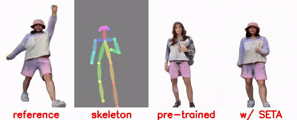
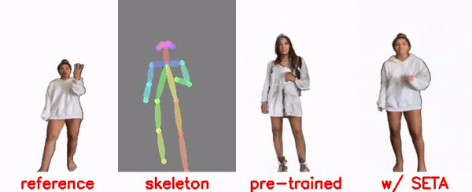
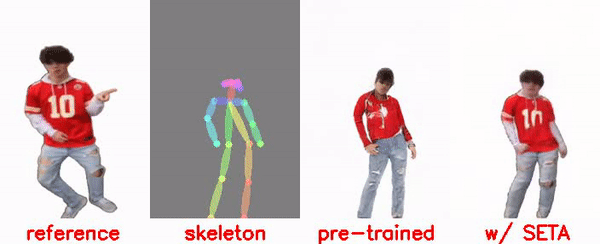
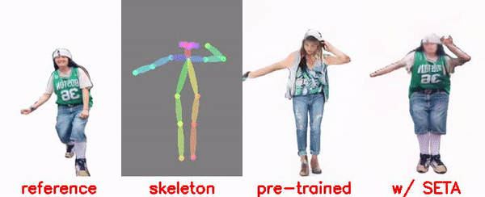
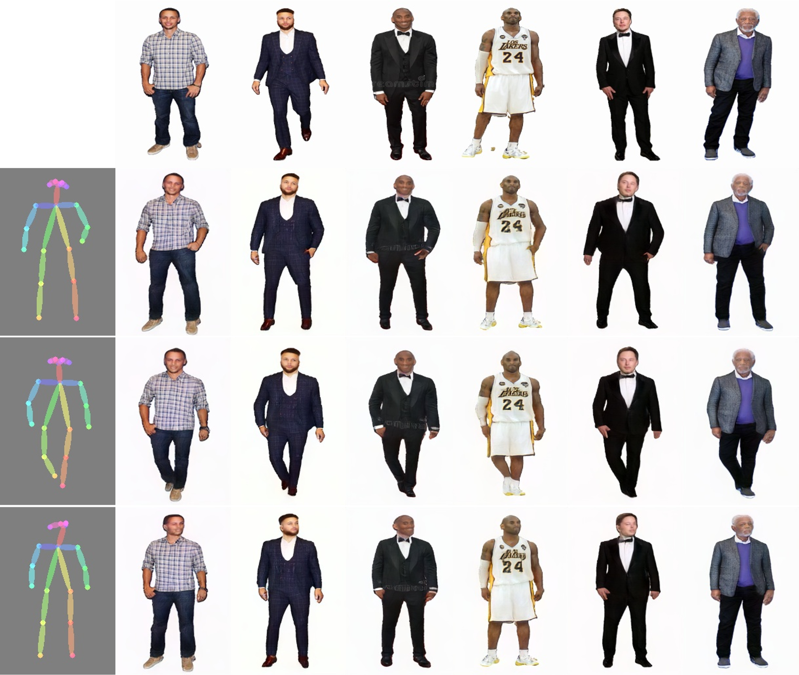

# 
Open-World Pose Transfer via Sequential Test-time Adaption

## 
Abstract

Pose transfer aims to transfer a given person into a specified posture, has recently attracted considerable attention. A typical pose transfer framework usually employs representative datasets to train a discriminative model, which is often violated by out-of-distribution (OOD) instances. Recently, test-time adaption (TTA) offers a feasible solution for OOD data by using a pre-trained model that learns essential features with self-supervision. However, those methods implicitly make an assumption that all test distributions have a unified signal that can be learned directly. In open-world conditions, the pose transfer task raises two independent signals: OOD appearance and skeleton, which need to be extracted and distributed separately. To address this point, we develop a SEquential Test-time Adaption (SETA). In the test-time phrase, SETA extracts and distributes external appearance texture by augmenting OOD data for self-supervised training. To make non-Euclidean similarity among different postures explicit, SETA uses the image representations derived from a person re-identification (Re-ID) model for similarity computation. By addressing two independent signals in the test phrase sequentially, SETA greatly improves the generalization performance of current pose transfer models. In our experiment, we first show that pose transfer can be applied to open-world applications, including Tiktok reenactment and celebrity motion synthesis.
## 
Open-World Applications

### Skeleton-driven Tiktok Reenactment.

 
 

### Open-World Celebrity Motion Synthesis.

## 
Qualitative Results

### More Visual Comparison on SHHQ.

 
 

