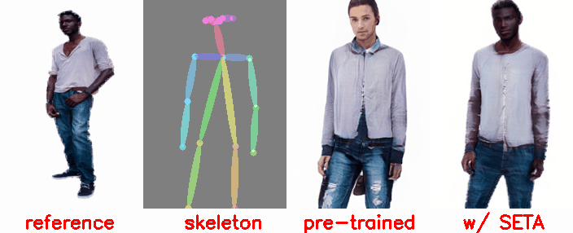
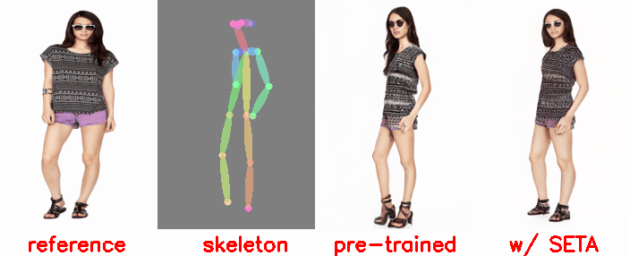
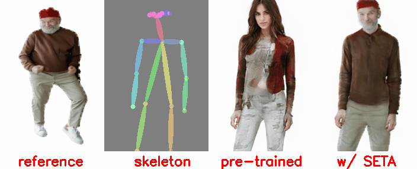
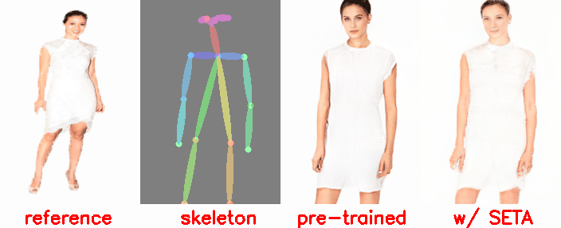

# TTA-Pose-Transfer

## Open-World Pose Transfer via Sequential Test-time Adaption
**We first build pose transfer under a open-world settings (OWPT), by which the model can handle arbitrary charac-
teristic and skeleton.**

**We propose SEquential Test-time Adaption (SETA) to generate realistic image on the OOD data.**

 
 

https://user-images.githubusercontent.com/117270461/199524610-8cfe521f-b30b-4e76-a88e-f7ac26fc5915.mp4

